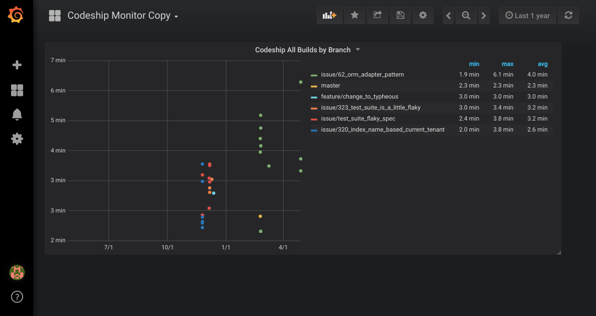

# codeship-monitor
A simple Ruby service for cataloging codeship organization data



- A codeship API client for ruby
- A scheduler to run this API request as a routine job (can be run seperately)
- Exhaustive persisting for all organisations attched to the account
- Grafana dashboard with [saved example](./codeship-dashboard.json)

# Contents

   * [codeship-monitor](#codeship-monitor)
      * [Setup](#setup)
         * [Logging Service Only (local)](#logging-service-only-local)
         * [Boot with Grafana and Logging Service](#boot-with-grafana-and-logging-service)
      * [Works In Progress](#works-in-progress)

## Setup

### Logging Service Only (local)

This service can be run standalone locally:

```
echo .env << "USERNAME={your codeship email}\nPASSWORD={your codeship password}"

bundle i

bundle exec rake db:setup

bundle exec ruby start.rb
```

### Boot with Grafana and Logging Service

Boot as:

```
echo .env << "USERNAME={your codeship email}\nPASSWORD={your codeship password}"
docker-compose up
```

Navigate to Grafana at `localhost:3000`

You can import the example dashboard from `./codeship-dashboard.json` and everything will be up and running.

## Works In Progress

- [ ] Seperate out client library into Codeship V2 API gem
